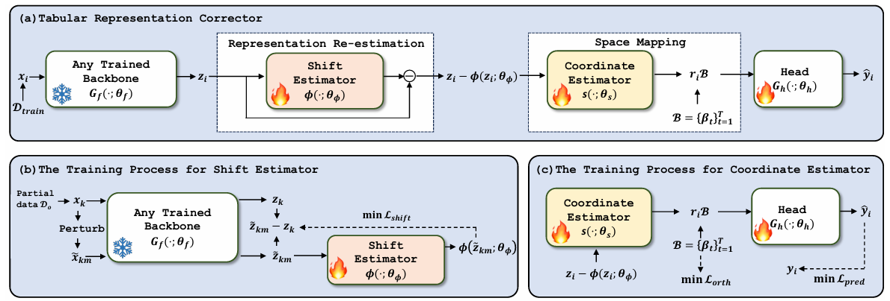

# Deep Tabular Representation Corrector (TRC)

### 📄 **[TPAMI 2025 Paper](https://ieeexplore.ieee.org/document/11270244)**

## 📖 Overview 

Tabular data are central to many real-world applications, but deep learning methods for tabular tasks often suffer from representation shift and redundancy. Existing approaches either train models from scratch with complex constraints (in-learning) or rely on costly pretraining with hand-crafted tasks (pre-learning). We propose TRC, a model-agnostic Tabular Representation Corrector that improves the representations of any trained deep tabular model without modifying its parameters. TRC introduces two lightweight components: 
- Representation Re-estimation, which learns to correct inherent representation shifts
- Tabular Space Mapping, which compresses the corrected representations into a compact embedding space while preserving predictive information. 

They enhance model representations efficiently. Experiments on multiple benchmarks show that integrating TRC consistently boosts performance across state-of-the-art tabular deep learning models.

<div align="center">
  
</div>  
 
### Running example
```bash
# Basic usage
python run.py --dataname DATA_NAME --model_type MODEL_NAME
# e.g.
python run.py --dataname california_housing --model_type FTTransformer

# Disable specific TRC components
python run.py --dataname DATA_NAME --model_type MODEL_NAME --shift_estimator False   # without shift estimator
python run.py --dataname DATA_NAME --model_type MODEL_NAME --space_mapping False     # without space mapping
python run.py --dataname DATA_NAME --model_type MODEL_NAME --loss_orth False         # without orthogonal loss

```


### Preparing Datasets
If you wish to use your own dataset,please follow:
```bash
cd TRC/data
mkdir [NAME_OF_YOUR_DATASET]
```
For the specific format of the dataset, please refer to https://github.com/LAMDA-Tabular/TALENT.

Specifically,each dataset folder args.dataset consists of:

-- Numeric features: N_train/val/test.npy (can be omitted if there are no numeric features)

-- Categorical features: C_train/val/test.npy (can be omitted if there are no categorical features)

-- Labels: y_train/val/test.npy

-- info.json, which must include the following three contents (task_type can be "regression", "multiclass" or "binclass"):
```bash
{
  "task_type": "regression", 
  "n_num_features": 10,
  "n_cat_features": 10
}
```


### For other model
```python
# traned_backbone: train_backbone for TRC
TRC_model = TRC(train_backbone,...)
TRC.fit(...)
```
## 🤗 Citing the paper

If our work is useful for your own, you can cite us with the following BibTex entry:

    @ARTICLE{11270244,
    author={Ye, Hangting and Wang, Peng and Fan, Wei and Song, Xiaozhuang and Zhao, He and Guo, Dandan and Chang, Yi},
    journal={IEEE Transactions on Pattern Analysis and Machine Intelligence}, 
    title={Deep Tabular Representation Corrector}, 
    year={2025},
    volume={},
    number={},
    pages={1-15},
    keywords={Training;Deep learning;Machine learning;Transformers;Transforms;Space mapping;Predictive models;Electronic mail;Vectors;Redundancy;Tabular data;deep neural networks;tabular representation learning},
    doi={10.1109/TPAMI.2025.3637810}}

  